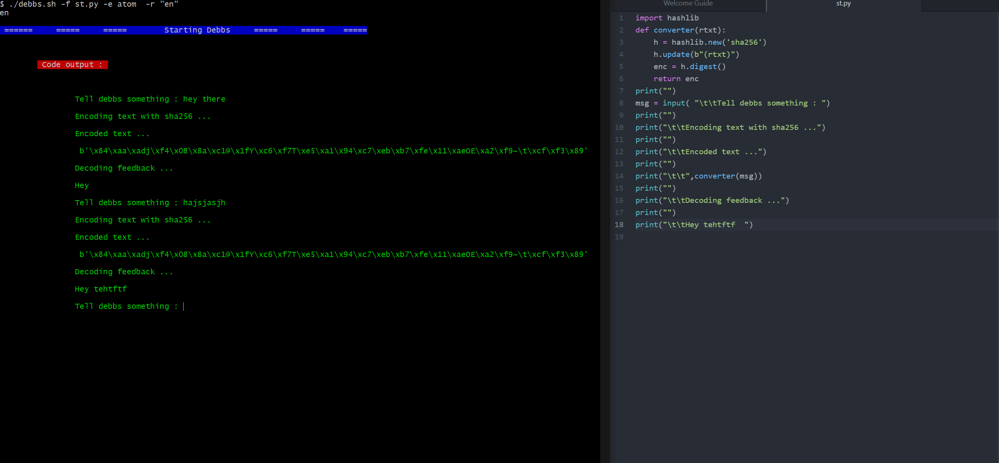

<h3>Debbs</h3>

Life of a programmer revolves around coding. Writing,compiling and testing code then writing again.

This coding  process may take time and can be tiring and  stressful, for example if you are working with languages like java , go , c# , c++ or c etc... , where you have to compile a source code then run its byte code or an executable hence repeating the same procedure again and again anytime you make an error or did not achieve desired results.

I wrote a bash a script to help me do all that


You run debbs and pass in a few arguments and let it do the magic . Give a file you want to open or if it doesn't exist the name you want to refer to it , editor you want to use for the job (optional) , whether to save the file or not once you are done with it or not (optional) , run on real mode (optional).

<b><i>Now comes the fun part </i></b>, debbs starts a session ,opens  the editor and once you're done coding. The moment you exit the editor it runs the file with correct run type procedure for the language you are using. Helps in any case you forget its run type procedure or you want to avoid a lot of typing .

<b><i> Awesome </i>.</b>
It then outputs the code results after compilation and run time.It has a  Real mode option which enables you can see code output while writing code itself.<b> Think of it as a live server  </b> 😂



<b><i>This whole process takes a short time </i></b> .Saves you time

<h3>Installation </h3>

Clone debbs repo

```
git clone https://github.com/Brian254ke/debbs.git
```

Go to the directory where you've cloned debbs repository .

Give debbs script execute permission

```
chmod +x debbs.sh
```

Add a symlink so that you can use debbs anywhere on the path in the terminal.

```
n=`pwd` | ln -sf   $n/debbs.sh     /usr/bin/debbs
```

If you don't want to add debbs to path . You will need to use absolute path whenever you want to use it .

ie ${PATH TO DEBBS} now do something with debbs.

     /home/pathtodebbs  --help

or

If you are on the same directory you can use it as follows :

     ./debbs.sh -f test.js

<h3>Usage</h3>

Using debbs is very easy. You need to memorize only a few  flags to pass in arguments.

| flag | full name | usage                                                        |
| ---- | --------- | ------------------------------------------------------------ |
| -he  | --help    | Display help menu.                                           |
| -us  | --usage   | See usage examples .                                         |
| -f   | --file    | Opens this files in an editor , creates it if doesn't exist  |
| -s   | --save    | Include option to remove the file at the end of the session. |
| -e   | --editor  | Specify the editor to use                                    |
| -o   | --output  | Redirect errors and output to a file.                        |
| -r   | --real    | Include option to enable real mode                           |

Nb: Nano is the default editor.

All files are saved by default.

<b>Usage examples</b>

See usage examples

> debbs -us

> debbs --usage

> debbs -he

> debbs --help

> debbs -f test.py

> debbs -f test.js -s no

> debbs -f test.go -e gedditor

> debbs -f test.sh -e vim -o /dev/null

> debbs -f test.prg -r en

> debbs -f test.cs -e code -o /dev/null -r en

> debbs -f test.java -e atom -s no -r en

<h3>Issues and  fixes</h3>

Debbs supports run and compile type for the following programming languages :

1. Python
2. Bash
3. Javascript
4. C
5. C#
6. Perl
7. Java
8. Go
9. C++

| Issue                                                                                        | Fix                                                                                                                                                                                                               |
| -------------------------------------------------------------------------------------------- | ----------------------------------------------------------------------------------------------------------------------------------------------------------------------------------------------------------------- |
| I don't get anything as output.                                                              | Check if you have the language compiler for the job or you forgot or misspelled the file extension while passing the name of the file. Or you directed standard error to a file by including -o \<errFile> option |
| Iam using vs code as my editor and the program terminates before I finished editing the code | Enable real mode "-r en" or try using a light weight editor. Use vim or gedditor or nano or vi and exclude the real mode option.                                                                                  |
| I don't see the file created                                                                 | You included the save no option. Use it only when you're sure you won't need the file.                                                                                                                            |
| Editor I specified did not open                                                              | Make sure if for example you are using vs code it is added to  path or you misspelled its name or you don't have it installed on your computer .                                                                                      |

While using light weight editors such as vim or nano or vi dont enable real mode but if you are using sublime text or vs code or atom or notepad or maybe notepad++ etc... You can use real mode.
enabled but terminate the process on the terminal once you are done hit ctr +c twice or if you forget to terminate the program, it exits after 3 minutes of inactivity.

<h4>Where can I use it ?</h4>

You can use debbs on any linux or unix like terminal emulators.

<b>Linux</b>

Works with bash , zsh or kish.

<b>Windows</b>

You need to have wsl installed (windows subsystem for linux)

Or you can use git bash.

<b>Mac </b>

Use posh git or git bash if you it have installed.

<h3>Thank you !</h3>

Open for contributions and improvements.


Come back for improvements .

Goodbye 👋


